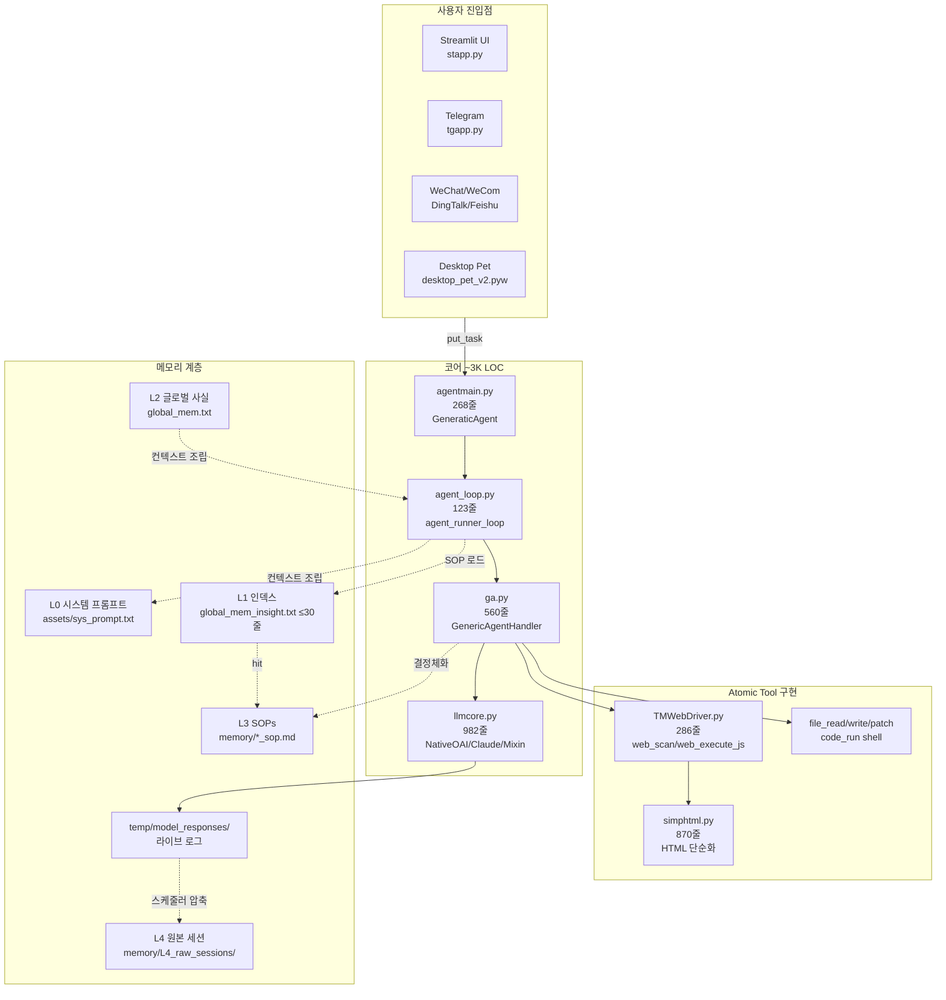
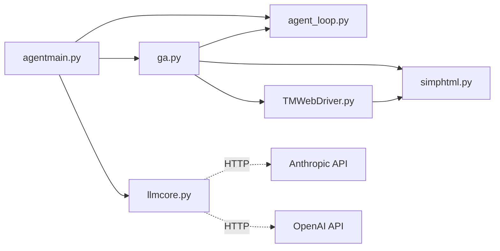
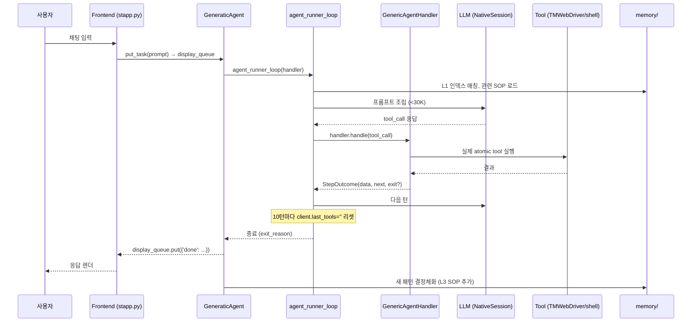

## 한눈에 보기

## 모듈 책임 분리

| 파일 | 줄수 | 역할 |
|---|---|---|
| `agentmain.py` | 268 | `GeneraticAgent` — 큐·세션·슬래시명령 라우팅 |
| `agent_loop.py` | 123 | `agent_runner_loop` — 턴 단위 실행, `StepOutcome` 종료 판정 |
| `ga.py` | 560 | `GenericAgentHandler` — atomic tool 디스패치, 결과 포매팅 |
| `llmcore.py` | 982 | `NativeOAISession` / `NativeClaudeSession` / `MixinSession` — LLM 호출·로깅 |
| `TMWebDriver.py` | 286 | 브라우저 인젝션 드라이버 (`web_scan`, `web_execute_js`) |
| `simphtml.py` | 870 | DOM → 단순화 텍스트 (TMWebDriver가 호출) |
| `launch.pyw` | 144 | Streamlit 부팅 + pywebview 창 + idle monitor |

총 **약 3,233줄** — README가 광고하는 "약 3K 줄"과 일치합니다.

## 의존 관계 (실제 import)

`agentmain` → `agent_loop` + `ga` + `llmcore`. `ga`가 atomic tool 디스패처라 `TMWebDriver`/`simphtml`을 연결합니다.

## 데이터 흐름 — 한 작업의 일생

## 메모리 계층과 코드의 매핑

| 계층 | 위치 | 누가 읽고/쓰는가 |
|---|---|---|
| L0 — 시스템 프롬프트 | `assets/sys_prompt.txt` | `agent_loop.py` (매 턴) |
| L1 — 인덱스 | `memory/global_mem_insight.txt` | `agent_loop.py` (매 턴, 키워드 매칭) |
| L2 — 글로벌 사실 | `memory/global_mem.txt` | LLM이 직접 추가, `agent_loop.py`가 매칭 시 로드 |
| L3 — SOP | `memory/*_sop.md`, `memory/skill_search/` | LLM이 `file_read`로 로드 |
| L4 — 원본 세션 | `memory/L4_raw_sessions/`, `temp/model_responses/` | `llmcore.py:852`가 append, `compress_session.py`가 정리 |

자세한 내용은 [Memory Hierarchy](/concepts/memory-hierarchy)를 참고하세요.

## 왜 이 구조인가?

- **단일 책임**: 4개 핵심 파일이 각자 한 가지만 함 → 신규 기여자가 추적 가능
- **얇은 atomic tool 레이어**: 도메인 확장은 `memory/*.py` helper로 — 코어를 안 늘림
- **계층형 메모리**: 컨텍스트 윈도우 `<30K` 유지하면서도 세션 간 학습 누적 가능
- **Frontend 무관**: 6종 메신저/UI가 모두 `agent.put_task` 한 줄로 코어와 분리

다른 에이전트 프레임워크와의 비교는 [comparison](/resources/comparison)에 있습니다.

## 관련

<CardGroup cols={2}>
  <Card title="Atomic Tools" icon="screwdriver-wrench" href="/concepts/atomic-tools">
    9개 도구의 시그니처
  </Card>
  <Card title="Agent Loop" icon="arrows-rotate" href="/concepts/agent-loop">
    123줄 루프의 내부
  </Card>
  <Card title="Memory Hierarchy" icon="layer-group" href="/concepts/memory-hierarchy">
    L0–L4 계층의 작동
  </Card>
  <Card title="LLM Core" icon="brain" href="/reference/llmcore">
    세션 클래스 API
  </Card>
</CardGroup>
