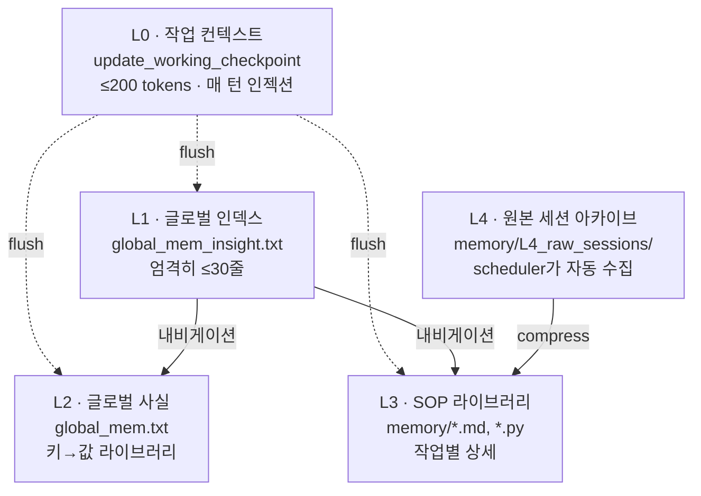

## 5층 메모리 피라미드



## 계층별 사양

<Tabs>
  <Tab title="L0 — 작업 컨텍스트">
    **파일**: 없음 (메모리 전용, 매 턴 인젝션)
    **도구**: `update_working_checkpoint`
    **크기**: ≤200 tokens
    **영속성**: 휘발 — 작업 완료 시 폐기
    **접근 빈도**: 매 턴
    **용도**: 사용자 요구사항, 핵심 제약, 함정, 진행 상태, 다음 단계 메모

    호출 타이밍 (스키마 발췌):
    - SOP 읽은 직후 핵심 제약 저장 (1-2 step 단순 작업은 스킵)
    - 서브태스크 전환 또는 컨텍스트 flush 직전
    - 반복 실패 후 SOP 재독 시 새 발견 저장 필수
    - 작업 전환 시 유효 제약은 유지하고 옛 진행 상태 정리
  </Tab>
  <Tab title="L1 — 글로벌 인덱스">
    **파일**: `memory/global_mem_insight.txt`
    **크기**: **엄격히 ≤30줄**
    **영속성**: 영구
    **접근 빈도**: 매 턴 (풀로딩)
    **용도**: L2/L3로 가는 극간결 내비게이션 인덱스

    구조:
    - 1계층: 고빈도 상황 `key → value` (sop/py/L2 섹션명을 직접 제공)
    - 2계층: 저빈도 상황은 키워드만 나열, 필요 시 L2 read 또는 `ls L3`로 직접 위치

    **금지**: 비밀번호·API Key 기록, "How to" 작성, 작업별 기술 세부, 로그 기록.
    **수정 규칙**: overwrite/code_run 비허용. 소량 patch만. 어려우면 손대지 않기.
  </Tab>
  <Tab title="L2 — 글로벌 사실">
    **파일**: `memory/global_mem.txt`
    **영속성**: 영구
    **접근 빈도**: L1 인덱스 매칭 시
    **용도**: 사실 라이브러리 — 환경 사실, 사용자 선호, 비민감 트리거 파라미터

    **동기화 규칙**: 변경 시 L1의 해당 TOPIC 내비게이션 줄을 갱신합니다 — 단, **내비게이션만 가능**합니다. 세부는 L1으로 옮기지 않습니다.
  </Tab>
  <Tab title="L3 — SOP 라이브러리">
    **디렉토리**: `memory/` (`.md` SOP + `.py` helper)
    **영속성**: 영구
    **접근 빈도**: L1 매칭 → 해당 파일만 로드
    **용도**: 특정 작업의 향후 재사용에 결정적인 소량의 상세 정보. **재사용 요구를 충족하는 한 가능한 한 짧게**.

    실제 SOP 예 (레포 내):
    ```text
    autonomous_operation_sop.md   github_contribution_sop.md
    ljqCtrl_sop.md                memory_cleanup_sop.md
    memory_management_sop.md      plan_sop.md
    procmem_scanner_sop.md        scheduled_task_sop.md
    supervisor_sop.md             tmwebdriver_sop.md
    verify_sop.md                 vision_sop.md
    web_setup_sop.md
    ```

    Helper 모듈 예: `adb_ui.py`, `ljqCtrl.py`, `ocr_utils.py`, `procmem_scanner.py`, `ui_detect.py`, `keychain.py`.
  </Tab>
  <Tab title="L4 — 원본 세션 아카이브">
    **디렉토리**: `memory/L4_raw_sessions/`
    **영속성**: 영구 (압축 후 정리)
    **접근 빈도**: 거의 없음 (필요 시만)
    **용도**: scheduler reflect가 자동 수집한 과거 세션 원본. 과거 컨텍스트 위치 추적용.

    `compress_session.py`가 L4 원본을 L3 SOP로 결정체화하는 압축 파이프라인을 담당합니다.
  </Tab>
</Tabs>

## 결정체화 규칙 — Action-Verified Axioms

`memory/memory_management_sop.md`의 헌법:

> **L1/L2/L3 에 기록되는 모든 정보는 성공한 도구 호출 결과(`shell` 실행 성공, `file_read` 로 내용 확인, 코드 실행 통과 등)에서 비롯되어야 합니다.**

> 조작은 허용되지만 **정확성과 추적 가능성은 잃지 않아야 합니다** — 문장 압축 가능, 계층 이동 가능 (L2 에서 L3 로).

## L1 ↔ L2/L3 동기화 규칙

| 조작 | L1 동기화 |
|---|---|
| L2/L3 신규 상황 추가 | 신규는 기본 저빈도 → L3 리스트에 파일명 추가 (자명하면 설명 없이, 직관에 반하면 괄호로 트리거 단어 2-4자) |
| L2/L3 상황 삭제 | 해당 계층의 키워드/매핑 줄 삭제 |
| L2/L3 값 수정 | 상황 위치에 영향 없으면 L1 미수정 |

> **동기화 레드라인**: L1에는 키워드/이름만, 세부 옮기기 금지. 괄호 안에는 트리거 단어 2-4자만, 메커니즘/방법/단계 기재 금지.

## 어디에 무엇을 둘 것인가

```text
정보를 저장해야 하는가?
├─ 일회성·작업 종료 후 무가치 → L0 (working checkpoint), 작업 종료 시 자동 폐기
└─ 재사용 가치 있음
   ├─ 환경 사실 / 사용자 선호 / 짧은 키→값 → L2 (global_mem.txt)
   │   → 빈도에 따라 L1 1계층(key→value) 또는 2계층(키워드만)에 등재
   ├─ 사고방식 준칙 / 헌법 1줄 → L1 [RULES]
   └─ 작업별 상세 절차 / 함정 모음 → L3 (memory/*.md SOP 또는 *.py 헬퍼)
```

## 더 보기

- 전체 헌법: `memory/memory_management_sop.md`
- 정리 절차: `memory/memory_cleanup_sop.md`
- 압축기: `memory/L4_raw_sessions/compress_session.py`
