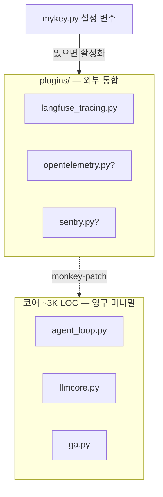

## 언제 보는가

새 외부 시스템(관측·로깅·알림)을 GenericAgent와 연결할 때 어디에 코드를 둘지 알고 싶을 때. 코어 ~3K줄을 부풀리지 않으면서 통합을 추가하는 자리입니다.

## 위치

```
plugins/
└── langfuse_tracing.py   # 현재 유일한 내장 플러그인 (5.5K)
```

## 작동 원리

`mykey.py`에 해당 설정 변수가 있을 때만 `llmcore.py`가 import → 플러그인이 자기 자신을 코어 함수에 주입합니다.

```python
# llmcore.py:24-26
if mk.get('langfuse_config'):
    try: from plugins import langfuse_tracing
    except Exception: pass
```

설정 없으면 import도 안 함 → langfuse 라이브러리 미설치여도 zero-impact.

## 코어 vs 플러그인 책임 분리



| 레이어 | 변경 가능 | 추가 시 |
|---|---|---|
| 코어 | 거의 동결 (3K 유지) | `llmcore.py`의 import 후크 한 줄만 |
| `plugins/<이름>.py` | 자유롭게 추가 | monkey-patch 로직 작성 |
| `mykey.py` | 사용자별 | 설정 변수 정의 |

## 패치 가능한 후크 (계약면)

| 후크 | 의미 | langfuse가 사용 |
|---|---|---|
| `llmcore._write_llm_log(label, content)` | 매 LLM Prompt/Response 로그 | ✅ generation span |
| `llmcore._parse_claude_sse` / `_parse_openai_sse` | SSE 응답 파싱 (token usage 추출) | ✅ usage_details |
| `agent_loop.BaseHandler.tool_before_callback` | 모든 atomic tool 호출 직전 | ✅ tool span 시작 |
| `agent_loop.BaseHandler.tool_after_callback` | 모든 atomic tool 호출 직후 | ✅ tool span 종료 |
| `agent_loop.agent_runner_loop` | 작업 전체 진입점 | ✅ outer agent trace |

이 5개 위치가 사실상 GenericAgent의 **공식 확장 포인트**입니다.

## 새 플러그인 만들기

`plugins/sentry_tracing.py` 예시 — 같은 패턴.

```python
"""Opt-in Sentry. Self-activates if sentry_config exists in mykey."""
try:
    from llmcore import _load_mykeys
    _cfg = _load_mykeys().get('sentry_config')
    import sentry_sdk
    if _cfg: sentry_sdk.init(**_cfg)
except Exception:
    _cfg = None

if _cfg:
    import agent_loop, llmcore

    _orig_after = agent_loop.BaseHandler.tool_after_callback
    def _patched_after(self, name, args, response, ret):
        if ret and getattr(ret, 'should_exit', False) and 'error' in str(ret.data):
            sentry_sdk.capture_message(f"Tool {name} failed: {ret.data}")
        return _orig_after(self, name, args, response, ret)
    agent_loop.BaseHandler.tool_after_callback = _patched_after
```

`llmcore.py`에 한 줄 추가:

```python
if mk.get('sentry_config'):
    try: from plugins import sentry_tracing
    except Exception: pass
```

## 안전 패턴 (필수)

<Tip>
  1. **원본 보존**: `_orig_X = module.X` 후 `return _orig_X(...)`로 호출
  2. **예외 격리**: monkey-patch 코드는 모두 `try/except: pass`로 감싸기 — 플러그인 에러가 코어를 죽이면 안 됨
  3. **Idempotent import**: 두 번 import되어도 안전하게 (활성화 플래그 등)
</Tip>

## 자주 빠지는 함정

<Warning>
  **여러 플러그인이 같은 함수를 patch하면 import 순서 의존**: 둘 다 살리려면 각자 직전 상태를 보관하고 체이닝. `langfuse_tracing.py:79-80`이 SSE 파서 체이닝의 표준 예시입니다.
</Warning>

<Warning>
  **`plugins/__init__.py` 만들지 마세요**: 현재 동적 import 패턴은 namespace package로 작동합니다. `__init__.py`를 추가하면 부수 import가 일어나서 zero-impact 보장이 깨집니다.
</Warning>

## 왜 이 구조인가?

| 일반 프레임워크 | GenericAgent |
|---|---|
| 코어에 telemetry hook 직접 박음 | `plugins/`로 격리, opt-in monkey-patch |
| 의존성이 항상 깔려야 함 | 설정 변수 없으면 import도 안 함 |
| 통합마다 코어가 부풀어남 | 코어는 영원히 ~3K줄 |

[Architecture](/concepts/architecture)의 미니멀리즘 원칙을 외부 통합에까지 확장한 형태입니다.

## 관련

<CardGroup cols={2}>
  <Card title="Plugins Guide" icon="plug" href="/guides/plugins">
    Langfuse 셋업 등 실전 가이드
  </Card>
  <Card title="LLM Core" icon="brain" href="/reference/llmcore">
    SSE 파서 등 패치 대상
  </Card>
  <Card title="Agent Loop" icon="arrows-rotate" href="/concepts/agent-loop">
    `BaseHandler` 후크의 자리
  </Card>
  <Card title="Architecture" icon="diagram-project" href="/concepts/architecture">
    미니멀 코어 + 외부 통합 자유도
  </Card>
</CardGroup>
