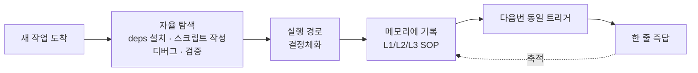

## 한눈에 보는 사이클

이 사이클이 GenericAgent를 다른 에이전트와 근본적으로 구분짓습니다.

## What you say · 첫 번째 · 그 이후

| 사용자가 말하는 것 | 처음 에이전트가 하는 일 | 두 번째부터 |
|---|---|---|
| *"위챗 메시지 읽어줘"* | deps 설치 → DB 리버스 → 읽기 스크립트 작성 → SOP 저장 | **한 줄 호출** |
| *"종목 모니터링하다가 알람 줘"* | mootdx 설치 → 종목 선택 플로우 구축 → cron 설정 → SOP 저장 | **한 줄 시작** |
| *"이 파일 Gmail로 보내줘"* | OAuth 설정 → 발송 스크립트 작성 → SOP 저장 | **즉시 사용 가능** |

몇 주 사용하면, 이 세상에 단 하나뿐인 **나만의 스킬 트리**가 자랍니다 — 모두 3K줄의 시드 코드에서 자란 것입니다.

## 사이클 4단계

<Steps>
  <Step title="새 작업">
    사용자가 자연어로 작업을 던집니다. 메모리에 매칭되는 SOP가 없으면 탐색 모드로 진입합니다.
  </Step>
  <Step title="자율 탐색">
    `code_run`으로 의존성을 설치하고, `web_scan`/`web_execute_js`로 페이지 구조를 살피고, `file_write`로 헬퍼 스크립트를 만듭니다. 실패하면 다시 시도합니다.
  </Step>
  <Step title="결정체화">
    성공한 실행 경로를 `start_long_term_update`로 결정체화합니다. **성공한 도구 호출 결과**만 사실로 채택됩니다 — 추측은 기록되지 않습니다.
  </Step>
  <Step title="메모리 기록">
    재사용 빈도에 따라 L1(인덱스) / L2(글로벌 사실) / L3(SOP 마크다운) 중 하나에 기록합니다. 다음번 동일 트리거에서 자동 로드됩니다.
  </Step>
</Steps>

## 왜 이 구조인가

<Tabs>
  <Tab title="사전주입 모델 (다른 에이전트)">
    - 개발자가 도구를 미리 만들어 둡니다 — `send_gmail`, `read_wechat`, `screen_stocks`...
    - 새 도메인이 생기면 새 도구를 추가해야 합니다.
    - 도구 카탈로그가 비대해지면서 컨텍스트 윈도우가 200K~1M으로 부풀어오릅니다.
    - 사용자별 맞춤화가 어렵습니다 — 모두 같은 도구 세트를 공유합니다.
  </Tab>
  <Tab title="진화 모델 (GenericAgent)">
    - 시드는 **9개 원자 도구**뿐입니다.
    - 새 도메인은 에이전트가 스스로 탐색해서 SOP를 작성합니다.
    - 컨텍스트는 30K 미만으로 유지됩니다 — 필요한 SOP만 로드되기 때문입니다.
    - 사용자별로 SOP 트리가 분기합니다 — **나만의 에이전트**가 자랍니다.
  </Tab>
</Tabs>

## Action-Verified Axioms

`memory/memory_management_sop.md`의 헌법 1조:

> **L1/L2/L3 에 기록되는 모든 정보는 성공한 도구 호출 결과(`shell` 실행 성공, `file_read` 로 내용 확인, 코드 실행 통과 등)에서 비롯되어야 합니다.**

이 규칙 덕분에 메모리는 시간이 지나도 오염되지 않고 누적됩니다. 추측·환각은 기록 단계에서 차단됩니다.

## 자가 부트스트랩 증거

이 레포의 모든 것 — git 설치부터 `git init`, 모든 커밋 메시지까지 — 은 GenericAgent가 자율적으로 수행했습니다. 저자는 단 한 번도 터미널을 열지 않았습니다.
