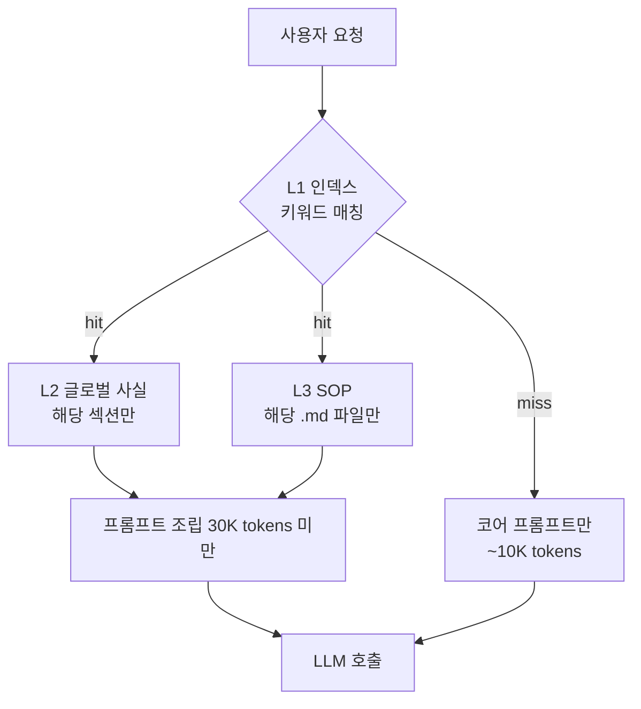

## 30K 미만 컨텍스트의 비밀

다른 에이전트가 200K~1M 컨텍스트를 통째로 로드할 때, GenericAgent는 **L1 인덱스를 먼저 보고 필요한 SOP만 골라 로드**합니다.

## 계층형 로딩의 작동 방식

<Steps>
  <Step title="L1 먼저">
    `memory/global_mem_insight.txt`는 **엄격히 ≤30줄**로 유지됩니다. 키워드 → SOP 파일명 매핑만 들어있어 매 턴 풀로딩해도 부담이 없습니다.
  </Step>
  <Step title="필요한 것만">
    사용자 요청을 L1과 매칭한 결과로 필요한 L2 섹션과 L3 SOP 파일만 컨텍스트에 추가합니다. 무관한 SOP는 메모리에 남아 있되 컨텍스트엔 들어가지 않습니다.
  </Step>
  <Step title="턴마다 갱신">
    `agent_loop.py`는 10턴마다 도구 설명도 리셋합니다 — `if turn%10 == 0: client.last_tools = ''` — 컨텍스트가 늘어나서 모델 성능이 떨어지는 걸 방지합니다.
  </Step>
</Steps>

## 다른 에이전트와 비교

| 에이전트 | 일반 컨텍스트 | 도구 수 | 도메인 확장 방식 |
|---|---|---|---|
| **GenericAgent** | **`<30K`** | **9 atomic** | SOP 파일 추가 |
| AutoGPT | 100K~ | 수십 개 | 플러그인 추가 |
| LangChain Agent | 50K~200K | 수백 개 (커뮤니티) | 새 Tool 클래스 |
| Browser-Use | 200K+ | DOM 트리 통째로 | 모델 컨텍스트 확장 |
| Devin류 | 1M+ | 사전 주입 다수 | 새 capability 추가 |

GenericAgent는 컨텍스트가 작은 만큼:
- **비용이 낮습니다** — 같은 작업당 토큰 비용이 1/10 수준입니다.
- **환각이 줄어듭니다** — 무관한 정보가 모델 attention을 흐리지 않습니다.
- **성공률이 올라갑니다** — 필요한 SOP만 보여주기 때문에 모델이 헤매지 않습니다.

## 공식 출처

> "Token Efficient: `<30K` context window — a fraction of the 200K–1M other agents consume. Layered memory ensures the right knowledge is always in scope. Less noise, fewer hallucinations, higher success rate — at a fraction of the cost." — README

기술 보고서: [arXiv:2604.17091 — *GenericAgent: A Token-Efficient Self-Evolving LLM Agent via Contextual Information Density Maximization*](https://arxiv.org/abs/2604.17091)
