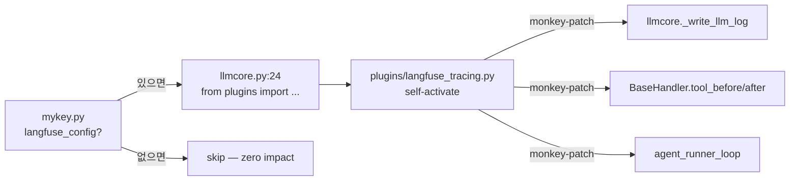

## 언제 쓰는가

LLM 호출·tool 실행을 외부 관측 도구(Langfuse, Sentry, Datadog, OpenTelemetry 등)로 보내야 할 때. **코어 3K줄을 건드리지 않고** 플러그인 파일 하나만 추가합니다.

## 작동 원리

`./plugins/` 디렉토리는 **opt-in monkey-patch 모듈**들이 사는 곳입니다. `mykey.py`에 해당 설정 변수가 있을 때만 `llmcore.py`가 import → 플러그인이 자기 자신을 코어 함수에 끼워넣습니다.



코어 파일은 단 한 줄도 수정되지 않습니다. 플러그인이 직접 함수를 갈아끼웁니다.

## 내장 플러그인

### Langfuse Tracing

LLM 호출 + 모든 atomic tool 실행을 Langfuse에 trace로 전송합니다.

<Steps>
  <Step title="Langfuse 설치">
    ```bash
    pip install langfuse
    ```
  </Step>
  <Step title="mykey.py에 설정 추가">
    ```python
    langfuse_config = {
        'public_key': 'pk-lf-...',
        'secret_key': 'sk-lf-...',
        'host': 'https://cloud.langfuse.com',  # 또는 자체 호스팅 주소
    }
    ```
  </Step>
  <Step title="에이전트 실행">
    ```bash
    python launch.pyw
    ```
    `mykey.py` 로드 시 `plugins.langfuse_tracing`이 자동 import → trace 시작.
  </Step>
  <Step title="대시보드 확인">
    Langfuse 대시보드에서 `agent.task` (작업) → `llm.chat` (모델 호출) → `tool` (atomic tool) 트리를 봅니다.
  </Step>
</Steps>

#### 추적되는 항목

| 스팬 종류 | 캡처 내용 | 패치 대상 |
|---|---|---|
| `agent` (`agent.task`) | 사용자 입력 → 최종 출력 | `agent_loop.agent_runner_loop` |
| `generation` (`llm.chat`) | Prompt / Response / token usage | `llmcore._write_llm_log` + SSE 파서 |
| `tool` (도구명) | args / data·next_prompt·should_exit | `BaseHandler.tool_before/after_callback` |

토큰 사용량은 SSE 응답에서 직접 파싱합니다 (`_extract_usage` — `message_start` / `message_delta` / `response.completed` 이벤트 처리, cache token 포함).

## 새 플러그인 만들기

같은 패턴으로 **Sentry, OpenTelemetry, Datadog** 등을 추가할 수 있습니다.

<Steps>
  <Step title="설정 변수 이름 정하기">
    `mykey.py`에 사용자가 적을 변수명 (예: `sentry_config`).
  </Step>
  <Step title="plugins/ 아래에 파일 추가">
    ```python
    # plugins/sentry_tracing.py
    try:
        from llmcore import _load_mykeys
        _cfg = _load_mykeys().get('sentry_config')
        import sentry_sdk
        if _cfg: sentry_sdk.init(**_cfg)
    except Exception:
        _cfg = None

    if _cfg:
        import agent_loop, llmcore
        # monkey-patch 코드 ...
    ```
  </Step>
  <Step title="llmcore.py에 import 후크 추가">
    ```python
    # llmcore.py:24 근처
    if mk.get('sentry_config'):
        try: from plugins import sentry_tracing
        except Exception: pass
    ```
    이 한 줄이 코어 변경의 전부입니다.
  </Step>
</Steps>

<Tip>
  **monkey-patch 안전 패턴**: 항상 원본을 변수에 보관(`_orig_log = llmcore._write_llm_log`)하고 patched 함수에서 `return _orig_log(...)`로 호출. 예외는 `try/except: pass`로 삼켜야 — 플러그인이 코어를 깨뜨리지 않습니다.
</Tip>

## 자주 빠지는 함정

<Warning>
  **`mykey.py`에 설정 변수를 안 적으면 import도 안 됩니다.** `langfuse` 라이브러리 미설치 환경에서도 zero-impact — 단, 변수를 적었는데 라이브러리는 없으면 `try/except`로 삼켜져서 조용히 비활성화됩니다. trace가 안 보이면 `pip list | grep langfuse`부터 확인하세요.
</Warning>

<Warning>
  **여러 plugin이 같은 함수를 patch하면 마지막 import가 이깁니다.** 둘 다 살리려면 각자 `_orig_*` 변수에 직전 상태를 보관하고 체이닝하세요 (`langfuse_tracing.py:79-80`이 SSE 파서를 그렇게 처리합니다).
</Warning>

## 왜 이 구조인가?

| 일반 프레임워크 | GenericAgent |
|---|---|
| 코어에 tracing/telemetry/logging 후크 직접 추가 | `plugins/`로 격리, opt-in monkey-patch |
| 의존성이 항상 깔려야 함 | 설정 변수 없으면 import도 안 함 |
| 코어가 통합마다 부풀어남 | 코어는 영원히 ~3K줄 |

**미니멀리즘 코어 + 외부 통합 자유도**를 동시에 잡는 패턴입니다. [Architecture](/concepts/architecture)의 핵심 철학이 여기서도 그대로 적용됩니다.

## 관련

<CardGroup cols={2}>
  <Card title="LLM Core" icon="brain" href="/reference/llmcore">
    `_write_llm_log`, SSE 파서가 patch 대상
  </Card>
  <Card title="Agent Loop" icon="arrows-rotate" href="/concepts/agent-loop">
    `agent_runner_loop`이 outer trace 진입점
  </Card>
  <Card title="Architecture" icon="diagram-project" href="/concepts/architecture">
    plugins가 코어 무손상으로 끼어드는 자리
  </Card>
  <Card title="Atomic Tools" icon="screwdriver-wrench" href="/concepts/atomic-tools">
    각 tool이 자동으로 `tool` span으로 추적됨
  </Card>
</CardGroup>
