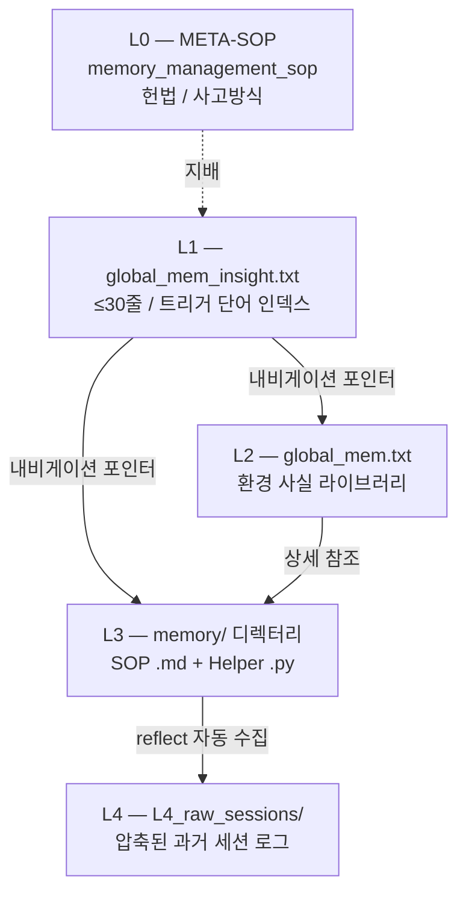

## 언제 쓰는가
새 정보를 어느 계층에 넣어야 할지 모를 때, 또는 메모리 구조를 처음 이해하려 할 때.

## 작동 원리 (Why)

LLM 컨텍스트는 가장 비싼 자원입니다. 매 라운드 모든 메모리를 컨텍스트에 우겨넣으면 토큰이 증발하고, 정작 작업 수행에 쓸 공간이 줄어듭니다. 계층화는 **"필요할 때만 깊게 읽는다"**를 위한 구조입니다.

## 계층 구조



## 각 계층 책임

| 계층 | 역할 | 크기 | 예 |
|---|---|---|---|
| **L0** | 헌법 / 메모리 관리 자체의 SOP | 1 파일 | `memory_management_sop.md` |
| **L1** | 극간결 인덱스 — "어떤 능력이 있는지"만 표현 | ≤30줄 | `tmwebdriver_sop(httponly cookie)` |
| **L2** | 환경 사실 — 경로, 인증정보, 포트 등 | 팽창 가능 | `## [PROXY] port=19531` |
| **L3** | 작업 단위 SOP / Helper | 다수 | `vision_sop.md`, `keychain.py` |
| **L4** | 과거 세션 압축 로그 | 자동 수집 | `0403_2013-0403_2245.txt` |

## 분류 빠른 결정 트리

```
"이 정보는 어느 계층에?"

『환경 특이적 사실』인가? (IP, 비표준 경로, 인증정보, ID, API 키)
  ├─ YES → L2
  │        그 다음 → 빈도에 따라 L1 1계층 (key→value) 또는 2계층 (키워드만)
  │
  └─ NO
       ↓
       『일반 조작 패턴』인가? (전역 함정 회피, 진단 방법)
       ├─ YES → L1 [RULES] (압축된 1줄 준칙만)
       │
       └─ NO
            ↓
            『특정 작업 기술』인가? (어렵게 성공한, 향후 재사용 작업)
            ├─ YES → L3 (../memory/ 의 SOP 또는 스크립트)
            │
            └─ NO → 일반 상식 / 중복 → 저장 엄금, 즉시 폐기
```

<Warning>
**L1 레드라인**: 비밀번호, API Key 기록 엄금. "How to" 또는 상세 설명 작성 금지. 특정 작업의 기술 세부 포함 엄금. 로그 기록 작성은 더더욱 엄금.
</Warning>

<Tip>
L1의 본질: **가능한 가장 짧은 단어 수로, 어떤 상황에서 어떤 메모리가 사용 가능한지(존재성)를 표현**.
</Tip>

## 관련
- [메모리 관리 SOP](/memory/sops/memory-management)
- [메모리 정리 SOP](/memory/sops/memory-cleanup)
- [L1 영구 메모리](/memory/persistent/global-insight)
- [L2 영구 메모리](/memory/persistent/global-mem)
- [L4 아카이브](/memory/persistent/l4-archive)
