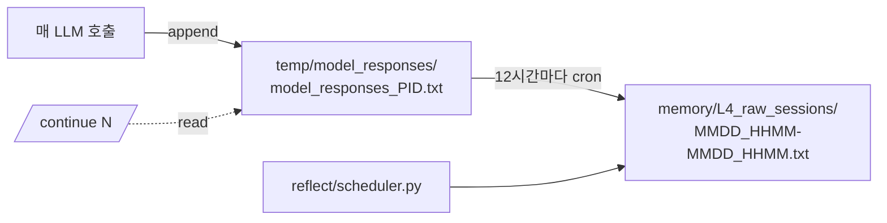

## 언제 보는가

- `/continue N`으로 과거 세션을 복원할 때 무엇이 들어있는지 알고 싶을 때
- 디버깅을 위해 직접 로그를 grep할 때
- L4 압축이나 자가증류 도구를 만들 때

## 두 단계 저장



| 단계 | 위치 | 누가 쓰는가 |
|---|---|---|
| 라이브 | `temp/model_responses/model_responses_<PID>.txt` | `llmcore.py:852` (매 호출 append) |
| 아카이브 | `memory/L4_raw_sessions/MMDD_HHMM-MMDD_HHMM.txt` | `compress_session.py` (scheduler가 12h마다 호출) |

## 라이브 로그 포맷

PID 단위 텍스트 파일. 호출마다 두 블록이 붙습니다.

```text
=== Prompt === 2026-04-29 17:42:07
{
  "role": "user",
  "content": [
    {
      "type": "text",
      "text": "what is your feature?"
    }
  ]
}

=== Response === 2026-04-29 17:42:15
[{'type': 'text', 'text': '<summary>현재 요청은 ...</summary>\n\n# 제 기능...'}]

=== Prompt === 2026-04-29 17:44:15
...
```

| 블록 | 시작 마커 | 본문 |
|---|---|---|
| 프롬프트 | `=== Prompt === <YYYY-MM-DD HH:MM:SS>` | LLM API에 보낸 메시지 (JSON) |
| 응답 | `=== Response === <YYYY-MM-DD HH:MM:SS>` | LLM에서 받은 content 배열 (Python repr) |

<Note>
  응답은 JSON이 아니라 **Python `repr()`** — 작은따옴표 사용. 파싱할 때 `ast.literal_eval` (안전한 리터럴 파서)을 쓰세요.
</Note>

## `<history>` 블록

`agentmain.py:124`의 `/continue` 요약 정규식이 사용하는 형식:

```text
<history>
[USER]: <사용자 입력 한 줄 요약>
[Agent]: <에이전트 응답 한 줄 요약>
</history>
```

UI가 이 마커로 과거 세션의 첫 사용자 메시지·마지막 요약을 추출합니다.

## L4 아카이브 포맷

`compress_session.py`가 만드는 압축 파일:

| 항목 | 형식 |
|---|---|
| 파일명 | `MMDD_HHMM-MMDD_HHMM.txt` (시작-종료 시각) |
| 위치 | `memory/L4_raw_sessions/` |
| 변환 규칙 | 라이브 로그를 그대로 보존하되 PID별 → 시간 범위별로 묶음 |

scheduler가 12시간마다 호출:

```python
# reflect/scheduler.py 일부
from compress_session import batch_process
batch_process('temp/model_responses', dry_run=False)
```

## 사용 예시

<CodeGroup>
```bash 라이브 로그 보기
ls -la temp/model_responses/
cat temp/model_responses/model_responses_$(pgrep -f stapp.py).txt | less
```

```python `/continue` 재현
import re, ast
content = open('temp/model_responses/model_responses_30115.txt').read()
content = content.replace('\\n', '\n').replace('\\r', '\r')
matches = re.findall(r'<history>\n\[(?:USER|Agent)\].*?</history>', content, re.DOTALL)
last = matches[-1] if matches else None
```

```bash L4 아카이브 보기
ls memory/L4_raw_sessions/
# 0429_1430-0429_1820.txt 같은 형식
```
</CodeGroup>

## 자주 빠지는 함정

<Warning>
  **PID는 재사용됩니다**. `model_responses_30115.txt`는 PID 30115가 종료된 뒤 다른 프로세스가 같은 PID를 받으면 append됩니다. UI의 `/continue`는 mtime으로 정렬하므로 보통 문제 없지만, 직접 파싱 시 PID로 식별하지 마세요.
</Warning>

<Warning>
  **응답 본문은 JSON이 아닙니다** — Python `repr()`. `json.loads()`는 실패하므로 `ast.literal_eval()` (안전한 리터럴 파서)을 쓰세요.
</Warning>

<Tip>
  L4 아카이브는 자가진화의 원료입니다. `memory_management_sop`의 "행동 검증 원칙"을 적용하려면 이 원본 로그가 살아있어야 합니다 — 함부로 지우지 마세요.
</Tip>

## 관련

<CardGroup cols={2}>
  <Card title="L4 Archive" icon="box-archive" href="/memory/persistent/l4-archive">
    아카이브의 정책과 활용
  </Card>
  <Card title="reflect/" icon="clock-rotate-left" href="/reference/reflect">
    압축 cron의 트리거
  </Card>
  <Card title="LLM Core" icon="brain" href="/reference/llmcore">
    `_write_llm_log`가 라이브 로그 작성
  </Card>
  <Card title="Memory Management SOP" icon="shield-halved" href="/memory/sops/memory-management">
    행동 검증 원칙의 원료
  </Card>
</CardGroup>
