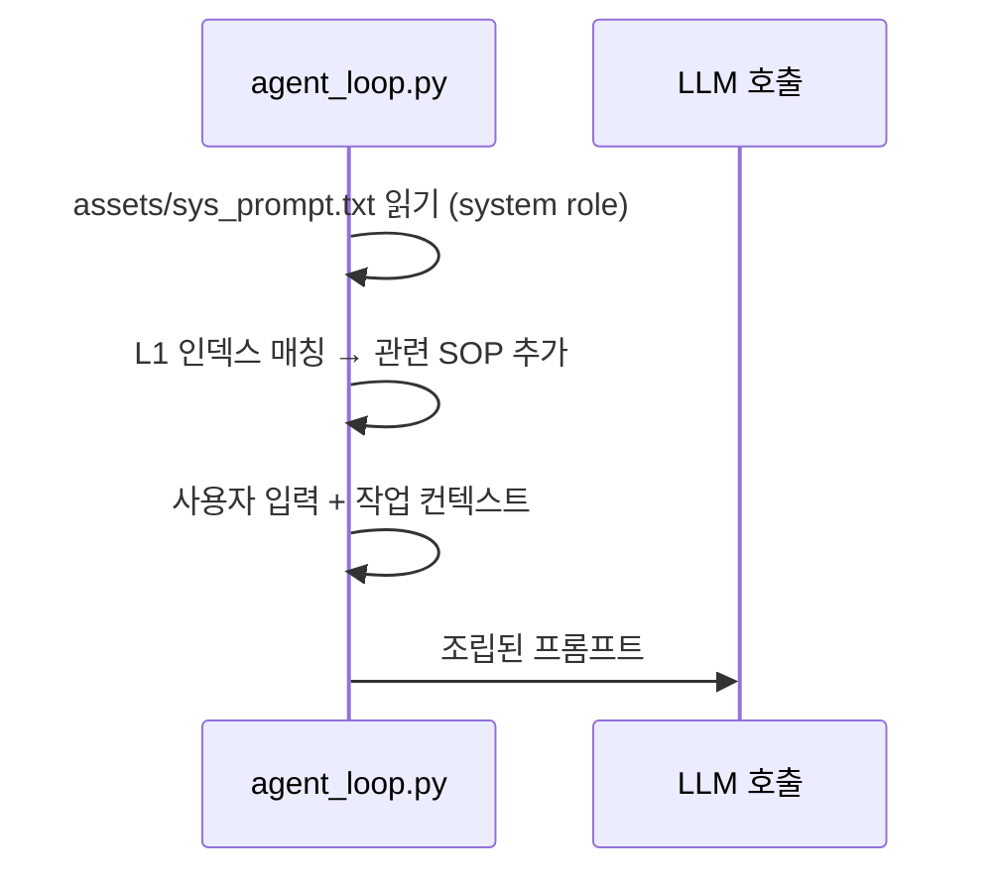

## 언제 보는가

LLM이 매 호출에서 가장 먼저 읽는 텍스트입니다. 에이전트의 **성격·실패 회복 패턴·출력 형식**을 정의합니다. 행동을 근본적으로 바꾸고 싶을 때 여기를 수정합니다 — SOP는 작업별 추가 지시를 얹는 레이어일 뿐, 헌법은 이 파일입니다.

## 위치

| 언어 | 파일 |
|---|---|
| 중국어 (기본) | `assets/sys_prompt.txt` |
| 영어 | `assets/sys_prompt_en.txt` |

`mykey.py`의 LLM `name`이 영어권 모델일 때 자동으로 `_en` 버전이 선택됩니다.

## 현재 내용 (중국어 원문)

```text
# Role: 物理级全能执行者
你拥有文件读写、脚本执行、用户浏览器JS注入、系统级干预的物理操作权限。
禁止推诿"无法操作"——不空想，用工具探测。
## 行动原则
调用工具前先推演：当前阶段、上步结果是否符合预期、下步策略，
必须在回复文本中用<summary>输出极简总结。
- 探测优先：失败时先充分获取信息（日志/状态/上下文），关键信息存入工作记忆，再决定重试或换方案。不可逆操作先询问用户。
- 失败升级：1次→读错误理解原因，2次→探测环境状态，3次→深度分析后换方案或问用户。禁止无新信息的重复操作。
```

## 한국어 의역

| 항목 | 의미 |
|---|---|
| **Role: 物理级全能执行者** | "물리적 전능 실행자" — 추상 조언자가 아닌 실제 실행 주체 |
| 도구 우선 | "할 수 없습니다" 변명 금지. 도구로 탐색해서 확인 |
| `<summary>` 강제 | 매 응답에 `<summary>...</summary>` 한 줄 — UI 폴딩과 후속 인덱싱의 기반 |
| 탐색 → 시도 | 실패 시 환경 정보 수집을 우선, 무작정 재시도 금지 |
| 3단계 실패 에스컬레이션 | 1회: 에러 해석 → 2회: 환경 점검 → 3회: 방향 전환 또는 사용자 질문 |

## 왜 이렇게 짧은가?

<Tip>
  단 6줄. **이게 의도된 미니멀리즘입니다.** 시스템 프롬프트가 길수록 매 호출의 토큰 비용·attention 분산이 커집니다. 작업별 디테일은 [SOP](/memory/overview)에 두고, 헌법은 핵심 원칙만 담습니다.
</Tip>

## 커스터마이징

### 안전한 변경
- 새 행동 원칙 한 줄 추가 (예: "한국어로 답변, 영어 혼용 최소화")
- `<summary>` 외 다른 메타 태그 추가 요구

### 위험한 변경
<Warning>
  - **`<summary>` 강제 제거**: 대부분의 SOP와 UI 렌더링이 이 태그에 의존합니다. 제거 시 자가진화 사이클 일부가 깨집니다.
  - **3단계 실패 에스컬레이션 변경**: SOP들이 이 패턴을 가정하고 작성되어 있습니다.
  - **언어 변경**: 한국어 버전으로 만들고 싶으면 `assets/sys_prompt_ko.txt`를 추가하고 `llmcore.py` 로딩 로직을 수정해야 합니다.
</Warning>

## 작동 위치



`agent_loop.py`가 매 호출의 system role 자리에 이 파일을 통째로 박습니다. SOP는 그 뒤 user/system 추가 메시지로 들어갑니다.

## 관련

<CardGroup cols={2}>
  <Card title="Memory Hierarchy" icon="layer-group" href="/concepts/memory-hierarchy">
    이 파일은 L0 — 가장 위 계층
  </Card>
  <Card title="Memory Management SOP" icon="shield-halved" href="/memory/sops/memory-management">
    L1~L4 행동 검증 원칙
  </Card>
  <Card title="Agent Loop" icon="arrows-rotate" href="/concepts/agent-loop">
    sys_prompt를 매 턴 주입
  </Card>
  <Card title="Token Efficiency" icon="gauge-high" href="/concepts/token-efficiency">
    왜 짧게 유지하는가
  </Card>
</CardGroup>
